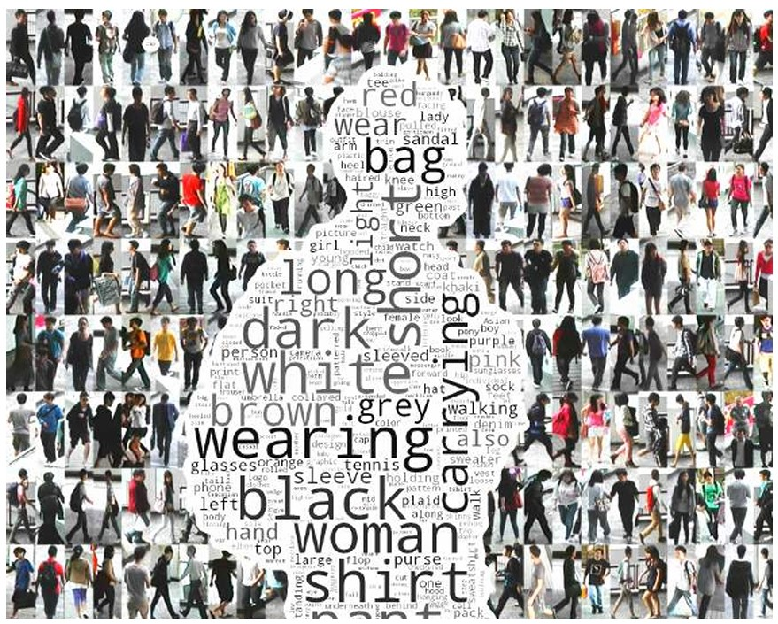
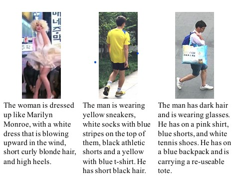
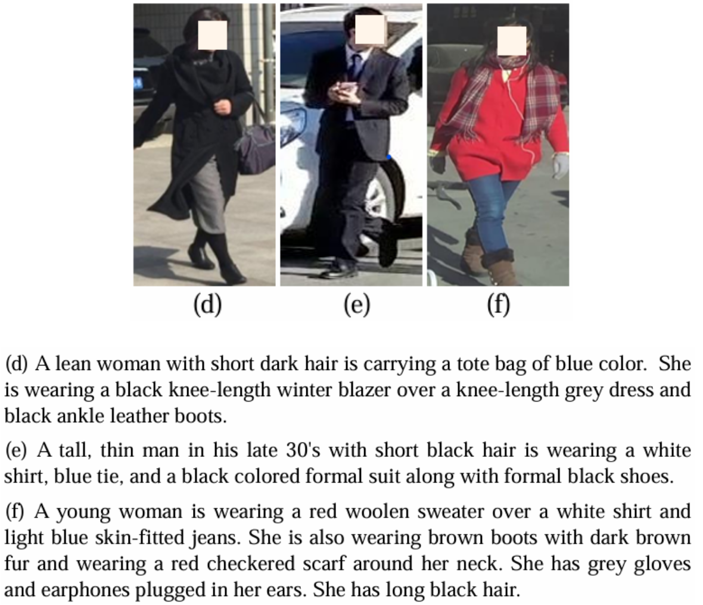
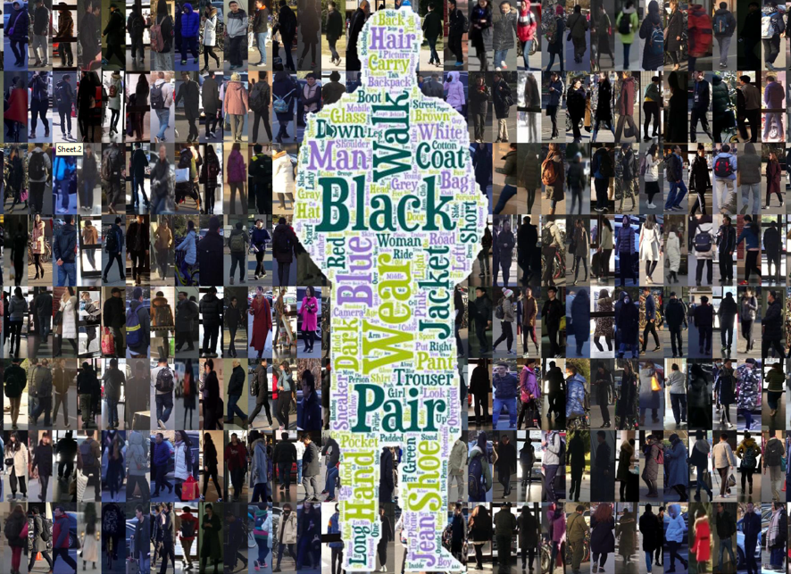
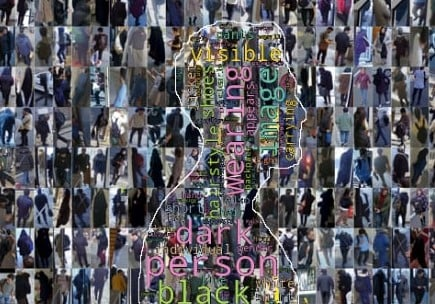

# TBPReid-datasets: A directory for Text-Based Person Retrieval Datasets.

## Directory Structure

The **TBPReid-datasets** directory consist of Text-based Person ReID datasets: [CUHK-PEDES](#CUHK-PEDES), [RSTPReid](#RSTPReID), [PRETRAIN](#PRETRAIN), [ICFG-PEDES](#ICFG-PEDES)
| Dataset | Release Time | No. image | No. description | No. ids | Avg word/text |
|----------|--------------|-----------|----------------|---------|---------------|
| [CUHK-PEDES](#CUHK-PEDES) | 2017 | 40,206 | 80,412 | 13,003 | 23.5 |
| [ICFG-PEDES](#ICFG-PEDES) | 2021 | 54,522 | 54,522 | 4,102 | 37.2 |
| [RSTPReid](#RSTPReID) | 2021 | 20,505 | 51,010 | 4,101 | 26.5 |
| [PRETRAIN](#PRETRAIN) (41K) | 2025 | 41,017 | 82,034 | 4,080 | 68.12 |
| [PRETRAIN](#PRETRAIN) (110K) | 2025 | 109,937 | 219,874 | 4,391 | 68.99 |

### Folder Structure

```
TBPReid-datasets/
│-- CUHK-PEDES/    
    |-- imgs
        |-- cam_a
        |-- cam_b
        |-- ... 
    |-- reid_raw.json     
    |-- README.md
|-- ICFG-PEDES/ #Coming soon
|-- RSTPReid/
    |-- imgs
    |-- data_captions.json 
    |-- README.md
│-- PRETRAIN/
    |-- imgs
        |-- ENTIReID
        |-- IUSTPersonReID
    |-- PRETRAIN_110K.json
    |-- PRETRAIN_41K.json     
    |-- README.md
|-- README.md
```
# [CUHK-PEDES](https://github.com/ShuangLI59/Person-Search-with-Natural-Language-Description)
<p align="center">
  
</p>

<p align="center">
  <em>High-frequency words and person images in CUHK-PEDES dataset</em>
</p>

<p align="center">
  
</p>

<p align="center">
  <em>Examples in CUHK-PEDES dataset</em>
</p>

The **CUHK-PEDES** dataset is a caption-annotated pedestrian dataset. It contains 40,206 images over 13,003 persons. Images are collected from five existing person re-identification datasets, CUHK03, Market-1501, SSM, VIPER, and CUHK01 while each image is annotated with 2 text descriptions by crowd-sourcing workers. Sentences incorporate rich details about person appearances, actions, poses.

>Shuang Li, Tong Xiao, Hongsheng Li, Bolei Zhou, Dayu Yue, Xiaogang Wang, "Person Search with Natural Language Description" in IEEE / CVF Computer Vision and Pattern Recognition Conference (CVPR), 2017


# [ICFG-PEDES](https://github.com/zifyloo/SSAN)
<p align="center">
  
</p>

<p align="center">
  <em>Examples in ICFG-PEDES dataset</em>
</p>

One large-scale database for Text-to-Image Person Re-identification, i.e., Text-based Person Retrieval.

Compared with existing databases, **ICFG-PEDES** (Identity-Centric and Fine-Grained Person Description Dataset) has three key advantages. First, its textual descriptions are identity-centric and fine-grained. Second, the images included in **ICFG-PEDES** are more challenging, containing more appearance variability due to the presence of complex backgrounds and variable illumination. Third, the scale of **ICFG-PEDES** is larger.

>Zefeng Ding, Changxing Ding, Zhiyin Shao, Dacheng Tao, "Semantically Self-Aligned Network for Text-to-Image Part-aware Person Re-identification" in IEEE, 2021

# [RSTPReID](https://github.com/NjtechCVLab/RSTPReid-Dataset)
<p align="center">
  
</p>

<p align="center">
  <em>High-frequency words and person images in RSTPReID dataset</em>
</p>

<p align="center">
  
</p>

<p align="center">
  <em>Examples in RSTPReID dataset</em>
</p>

**RSTPReid** contains 20,505 images of 4,101 persons from 15 cameras. Each person has 5 corresponding images taken by different cameras with complex both indoor and outdoor scene transformations and backgrounds in various periods of time, which makes RSTPReid much more challenging and more adaptable to real scenarios. Each image is annotated with 2 textual descriptions. For data division, 3701 (index < 18505), 200 (18505 <= index < 19505) and 200 (index >= 19505) identities are utilized for training, validation and testing, respectively (Marked by item 'split' in the JSON file). Each sentence is no shorter than 23 words.

>Aichun Zhu, Zijie Wang, Yifeng Li, Xili Wan, Jing Jin, Tian Wang, Fangqiang Hu, Gang Hua, "DSSL: Deep Surroundings-person Separation Learning for Text-based Person Retrieval" in ACMMM, 2021

# PRETRAIN

<p align="center">
  
</p>

<p align="center">
  <em>High-frequency words and person images in PRETRAIN dataset</em>
</p>

<p align="center">
  
</p>

<p align="center">
  <em>Examples in PRETRAIN dataset</em>
</p>


Refer to [this](PRETRAIN/README.md) for more information.

